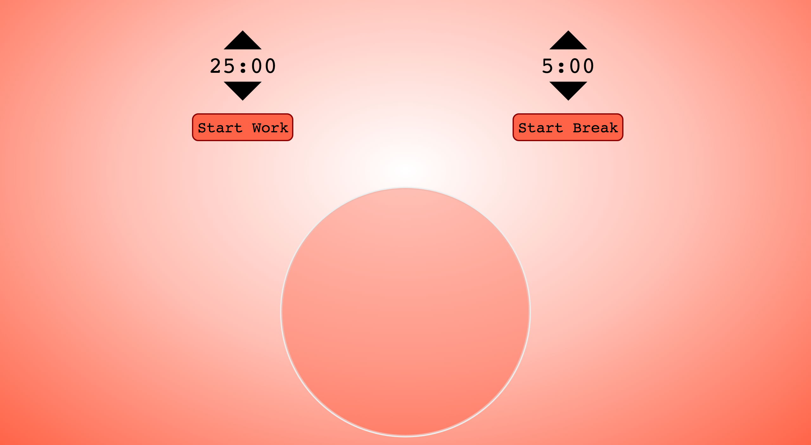

# FCC_Pomodoro
A pomodoro productivity web app for Free Code Camp.

## Live demo
[Pomodoro Demo](https://rmcavin.github.io/FCC_Pomodoro/)

## Free Code Camp Project Link
[Free Code Camp Project Description](https://www.freecodecamp.org/challenges/build-a-pomodoro-clock)

## Project Requirements
* **User Story:** I can start a 25 minute pomodoro, and the timer will go off once 25 minutes has elapsed.

* **User Story:** I can reset the clock for my next pomodoro.

* **User Story:** I can customize the length of each pomodoro.
